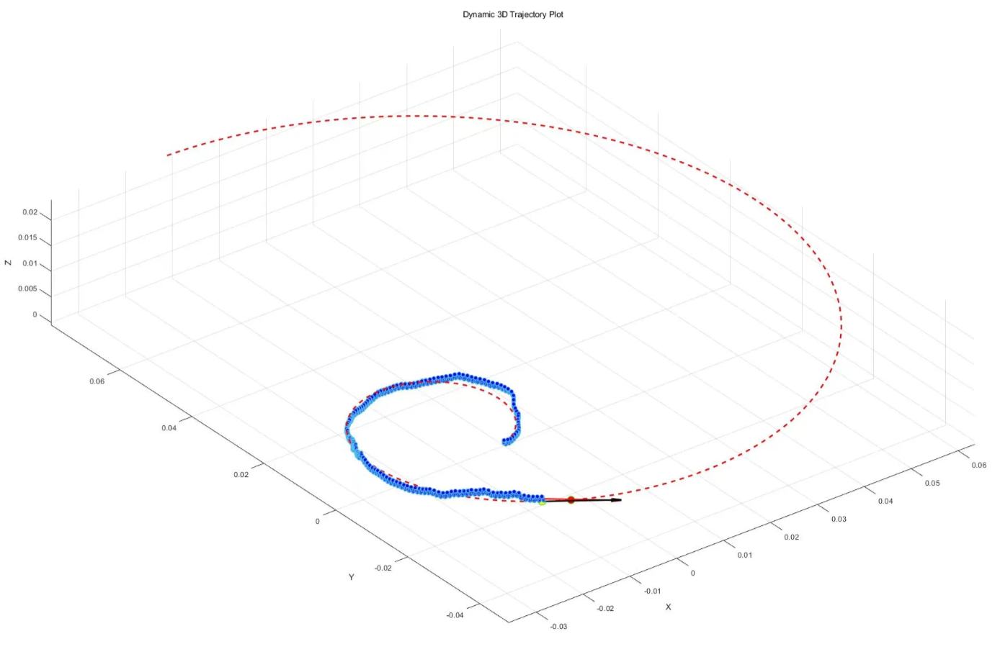
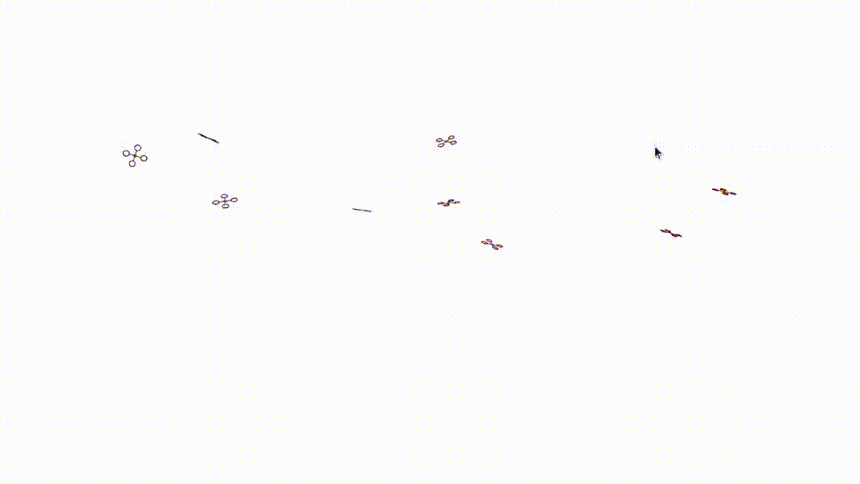
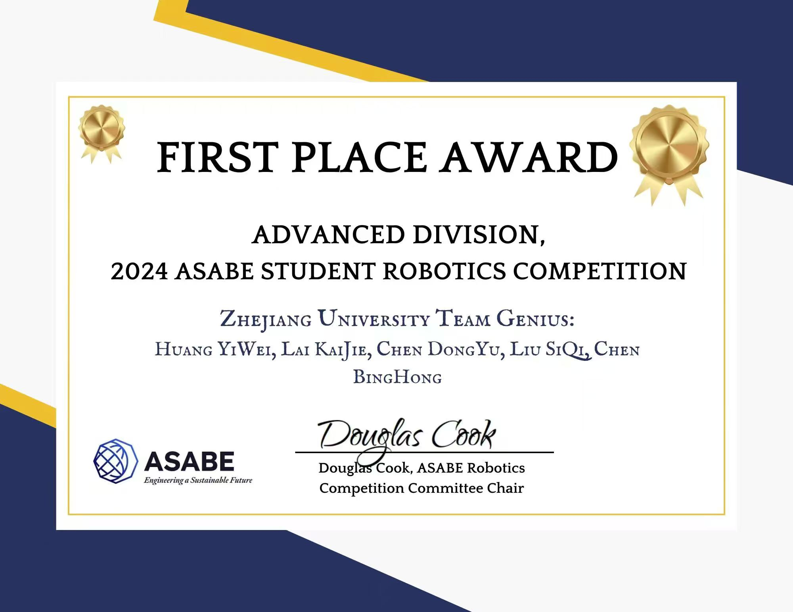
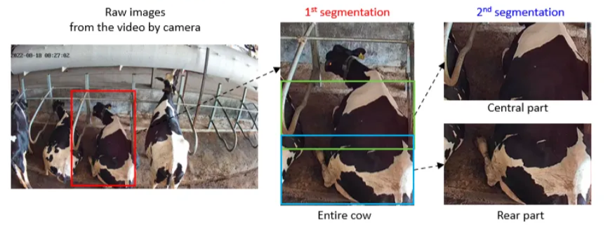

# Sample of Work

## Research Experience
---

> Most of my research experiences focus on reinforcement learning for locomotion. My research in Zhejiang University about soft magnetic robot are supervised by prof.[Mingchuan Zhou](https://scholar.google.com/citations?user=DdMIRNUAAAAJ&hl=en&oi=ao). I also participate in summer research internship about fault tolerant control of quadrotor in [Arclab](https://arclab.hku.hk/), the University of Hong Kong, supervised by prof.[Peng Lu](https://scholar.google.com/citations?user=ts7ItWgAAAAJ&hl=en&oi=ao).
> 

### **Capturing Dynamic Target with a Magnetic Soft Microgripper Via Transformer-based RL**
---

> Please turn to  https://github.com/fanghaow/TRL-DVO for latest information, here are just some quick view and supplementary information.
> 

**Magnetic System Overview**

  

- Design a microgripper actuated by the magnetic fields in 2D plannar capable of capturing tiny objects like cells and transportation.
- Yolo for identification of the robot, the object, the obstacles.

> If you are interested, you can refer to [DOI: 10.34133/cbsystems.0109](https://doi.org/10.34133/cbsystems.0109),  ****this is the previous work of our lab focusing on the system design.
> 

**Navigation System**

- **Transfomer-based RL:**We propose a novel network framework with several attention layers and CNN to process image information and virtual lidar information.
- **Deterministic VO and Curriculum Learning:** We include a simplified and deterministic VO as a guidance in training process. A curriculum learning is also included.
- **Sim-to-Real:** In simulation it can achieve a success rate of nearly 90% but lower in reality due to system delay and unprecise model. We spent some time for system identification and low level control loop to reduce system delay.
****

> The ideas are primarily inspired by https://github.com/TempleRAIL/drl_vo_nav and https://github.com/Mehooz/vision4leg.
> 

**Demonstrations**

- Capturing dynamic target in simulation

  

- Capturing dynamic target in reality

  

**My Contribution**

- Responsible for independently designing and implementing Transformer-based RL in simulation, as well as fine-tuning the model for optimal performance.
- Assist in solution of deterministic VO.
- Assist in frabrication, real experiment and reducing system delay.
- Parts of paper writing.

**The Work Going On**

- **Paper Writing:** we will submitted paper before 2025.1.15
- **Ablation Experiment, Comparison and Real experiment**: We are testing the contribution of each component of our network framework while also comparing it with other RL and traditional methods for navigation. We are also testing its ability to capture different dynamic objects including Zebrafish, Mosquito egg and micro magnetic spheres.

## Bio-inspired Magnetic Robot via model-based meta reinforcement learning
---

> Our goal is to design a soft magnetic robot capable of performing versatile tasks within different enviroments.
> 

**Key features**

- Design a soft magnetic robot inspired by the locomotion mechanism of fish capable navigating in 3D space.
- We model it as interactions between several linkages and demonstrate it in Matlab but it is highly unprecise in reality.
- We are trying to trained a model via a modified version of https://github.com/danijar/dreamerv3.

**Demonstrations**

- Demonstrate our model in Matlab but failed in real tests.

  

- PID controller for its heading successfully achieve trajectory tracking.

  

**My contribution**

- Design and frabrication of the robot.
- Assist in modeling.

**Future Work**

- Exploring ways to overcome sim-to-real gap and deploy model-based RL network in reality.
- Combine meta learning for adaption in different liquid enviroments.

## Fault-tolerant control for quadrotor via a fast reinforcement learning approach
---

> Its goal is to train an end-to-end uniform passive controller capable of overcaming any fault situations. This work is focusing on training an end-to-end fault tolerant controller under single rotor failure situation.
> 

**Key features**

- A completely end-to-end fault tolerant controller under single rotor failure
- Based on https://github.com/rl-tools/rl-tools, a completely C++ libary which enable fast training.
- A curriculum learning is included.

> It is modified from https://github.com/arplaboratory/learning-to-fly. The simulator is completely the same.
> 

**Demonstrations of simulation**

- First stage: Learn to stablize

  

- Second stage:Learn to control attitude

  

- Third stage:Learn to control position

  

**My contribution**

- Implement RL in simulation and tune parameter.
- Replicate the work “learning to fly in seconds” in simulation and reality.
- Parts of paper writing.

**The Work Going On**

- Paper Writing: This work has been passed on to a Mphil student of the lab, the paper will be submitted as soon as possible after all the experiments have been done.
- Ablation Experiment and Real Experiment

## Project Experiences
---

> I participated in some robot competitions which inspire my extensive interest on robotics. In majority, I am responsible for designing mechanisms.
> 

### 2024 ASABE Student Robotics Competition
---

**Demonstrations**

- You could find the record and details in [Robotics Competition](https://asabe.org/Robotics). But they mistook the division,hh.

  

- It is about a leaf-trimming robot.

  

**Key Features**

- Yolov8 for identifications
- Multiple end-effectors

**My Duty**

- Design the whole system and basic controller

### 2023 China Agricultural Robot Competition
---

**Demonstrations**

- It is about a  strawberry-cutting robot.

  

**Key Features**

- Color distinguish
- Five-bar mechanism

**My Duty**

- Design the whole system and basic controller

**Additional Information**
---

Before focusing on robotics, I spent a long time exploring my interest. 

**Machine Vision for Respiration Rate of Cows**

- Capture, segmentation and anlysis of motion signals

  

- This project is a student research training programm, you could find details in [https://doi.org/10.3390/agriculture14010040](https://doi.org/10.3390/agriculture14010040).
- Eulerian Video Magnification for amplifying small motion signals, Horn-Schunck optimal method for respiration rate estimation.
- I am responsible for recording video, assisting in implementation in Matlab.

**Other Interesting Awards:**

Third Prize in the Zhejiang Province Material Microstructure Competition

Volunteer Star