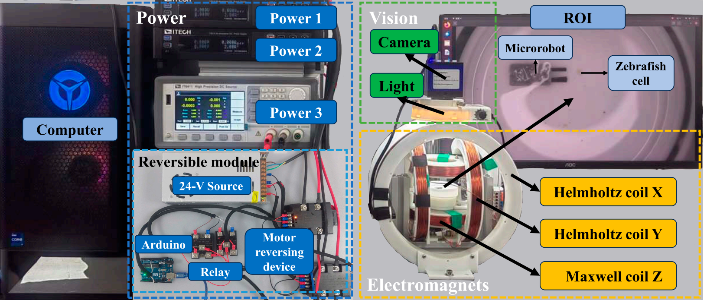

# Sample of Work

## Research Experience
---

> Most of my research experiences focus on reinforcement learning for locomotion. My research in Zhejiang University about soft magnetic robot are supervised by prof.[Mingchuan Zhou](https://scholar.google.com/citations?user=DdMIRNUAAAAJ&hl=en&oi=ao). I also participate in summer research internship about fault tolerant control of quadrotor in [Arclab](https://arclab.hku.hk/), the University of Hong Kong, supervised by prof.[Peng Lu](https://scholar.google.com/citations?user=ts7ItWgAAAAJ&hl=en&oi=ao).
> 

### **Capturing Dynamic Target with a Magnetic Soft Microgripper Via Transformer-based RL**
---

> Please refer to https://github.com/fanghaow/TRL-DVO for the latest information. The following provides a quick overview and supplementary details.
> 

**Magnetic System Overview**

  

- Design a microgripper actuated by the magnetic fields in 2D plannar capable of capturing and transporting tiny objects such as cells.
- Yolo for identification of the robot, the object and obstacles.

> If you are interested, you can refer to [DOI: 10.34133/cbsystems.0109](https://doi.org/10.34133/cbsystems.0109), this is the previous work of our lab focusing on the system design.
> 

**Navigation System**

- **Transfomer-based RL:** We propose a novel network framework with several attention layers and CNN to process image information and virtual LiDAR information.
- **Deterministic VO and Curriculum Learning:** We include a simplified and deterministic VO as a guidance in training process. A curriculum learning is also included.
- **Sim-to-Real:** In simulation it can achieve a success rate of nearly 95% but lower in reality due to system delay and the imprecise model. We have dedicated time to system identification and refining low level control loop to reduce system delay.
****

> The ideas are primarily inspired by https://github.com/TempleRAIL/drl_vo_nav and https://github.com/Mehooz/vision4leg.
> 

**Demonstrations**

- Capturing dynamic target in simulation

  

- Capturing dynamic target in reality

  

**Key Ideas**

- When faced with cluttered environments and dynamic objectives, many navigation methods show limited performance. In contrast, RL excels in tasks that are difficult to analyze or model.
- The novel network framework, combining attention layers and CNNs, is designed to extract spatial and temporal features from multi-modal inputs, significantly enhancing navigation performance. 
- DVO (Deterministic Velocity Obstacles) is an improved version of the Velocity Obstacles algorithm. The key improvement is replacing the sampling-based approach with an analytical method, which greatly enhances computational efficiency during the training process. It has been demonstrated that providing such guidance is particularly beneficial during the early stages of training. 
- Curriculum learning plays a crucial role in training. Starting the agent with overly difficult tasks often results in poor performance, even if a policy is eventually learned. Gradual task progression is essential for effective training.
- Sim-to-Real transfer is especially challenging due to a significant system delay of approximately 0.7 seconds. This delay, caused by coil mutual inductance, is nearly impossible to eliminate. By incorporating this delay into the simulation, the resulting policy became conservative.

**My Contribution**

- Responsible for independently designing and implementing the network workframe in simulation, as well as tuning parameters for optimal performance.
- Assist in solution of deterministic VO.
- Assist in frabrication, real experiment and reducing system delay.
- Parts of paper writing.

**The Work Going On**

- **Paper Writing:** we will submitted paper before 2025.1.15
- **Ablation Experiment, Comparison and Real experiment:** We are evaluating the contribution of each component in our network framework and comparing its performance with other reinforcement learning (RL) and traditional navigation methods. Additionally, we are testing its ability to capture various dynamic objects, including zebrafish, mosquito eggs, and micro magnetic spheres.

## Bio-inspired Magnetic Robot via Model-based Meta Reinforcement Learning
---

> Our goal is to design a soft magnetic robot capable of performing versatile tasks within different enviroments.
> 

**Key Features**

- Design a soft magnetic robot inspired by the locomotion mechanism of fish capable navigating in 3D space.
- We model it as interactions between several linkages and demonstrate it in Matlab but it is highly imprecise in reality.
- We are trying to trained a model via a modified version of https://github.com/danijar/dreamerv3.

**Demonstrations**

- Demonstrate our model in Matlab but failed in real tests.

  

- PID controller for its heading successfully achieve trajectory tracking.

  

**Key Ideas**

- Frequently changing the magnetic field causes the magnetic head to swing, enabling the entire body to move in a fish-like manner. Using PID control for its head angle to manage its motion has proven to be efficient.
- Due to the difficulty in precisely modeling its motion, we are exploring model-based reinforcement learning (RL) to train an agent using real-world data.
- Given its unique locomotion mechanism, the tasks it can perform are quite limited. We are actively seeking meaningful and impactful applications for it.

**My Contribution**

- Design and frabrication of the robot.
- Assist in modeling.

**Future Work**

- Exploring ways to overcome sim-to-real gap and deploy model-based RL network in reality.
- Combine meta learning for adaption in different liquid enviroments.

## Fault-tolerant Control for Quadrotor via a Fast Reinforcement Learning Approach
---

> Its goal is to train an end-to-end, uniform passive controller capable of overcoming any fault situations. This work focuses on training an end-to-end fault-tolerant controller specifically for single-rotor failure scenarios.
> 

**Key Features**

- A completely end-to-end fault tolerant controller for single rotor failure
- Based on https://github.com/rl-tools/rl-tools, a completely C++ libary which enable fast training.
- A curriculum learning is included.

> It is modified from https://github.com/arplaboratory/learning-to-fly. The simulator is completely the same.
> 

**Demonstrations of Simulation**

- First stage: Learn to stablize

  

- Second stage: Learn to control attitude

  

- Third stage: Learn to control position

  

**Key Ideas**

- To successfully train a drone in simulation, adding some  direct information about fault to the observation significantly improves training performance.
- To stabilize a faulty drone, it must perform a combined self-rotation (spin) and orbital rotation (revolution) to counteract the torque and force.
- Compared to designing a traditional controller, reinforcement learning eliminates the need for modeling complex systems and operates with less control redundancy, making it a more efficient solution in such scenarios.
- Sim-to-Real transfer is particularly challenging due to the system's high instability and the limitations of sensors with low accuracy and frequency.

**My Contribution**

- Implement RL in simulation and tune parameter.
- Replicate the work “learning to fly in seconds” in simulation and reality.
- Parts of paper writing.

**The Work Going On**

- **Paper Writing:** This work has been passed on to a Mphil student of the lab, the paper will be submitted as soon as possible after all the experiments have been conducted.
- **Ablation Experiment and Real Experiment**

## Project Experiences
---

> I participated in some robot competitions which inspired my extensive interest on robotics. In most cases, I am responsible for designing mechanisms.
> 

### 2024 ASABE Student Robotics Competition
---

**Demonstrations**

- You could find the record and details in [Robotics Competition](https://asabe.org/Robotics). But they mistook the division,hh.

  

- It is about a leaf-trimming robot.

  

**Key Features**

- Yolov8 for identifications
- Multiple end-effectors

**My Duty**

- Design the whole system and basic controller

### 2023 China Agricultural Robot Competition
---

**Demonstrations**

- It is about a strawberry-cutting robot.

  

**Key Features**

- Color distinguish
- Five-bar mechanism

**My Duty**

- Design the whole system and basic controller

**Additional Information**
---

Before focusing on robotics, I spent a long time exploring my interest. 

**Machine Vision for Respiration Rate of Cows**

- Capture, segmentation and anlysis of motion signals

  

- This project is a student research training programm, you could find details in [https://doi.org/10.3390/agriculture14010040](https://doi.org/10.3390/agriculture14010040).
- Eulerian Video Magnification for amplifying small motion signals, Horn-Schunck optimal method for respiration rate estimation.
- I am responsible for recording video, assisting in implementation in Matlab.

**Other Interesting Awards:**

Third Prize in the Zhejiang Province Material Microstructure Competition

Volunteer Star